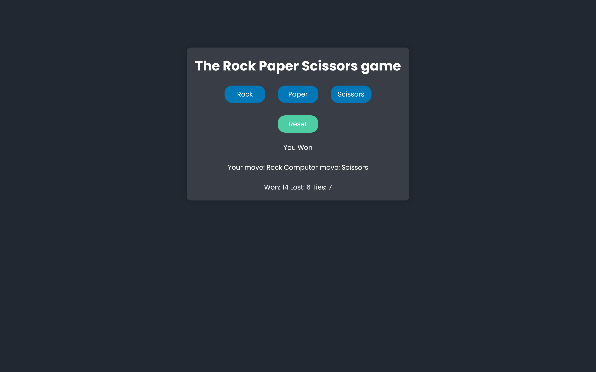

# Rock, Paper, Scissors Game

A simple web-based Rock, Paper, Scissors game where you can play against the computer.

## Table of Contents

- [Rock, Paper, Scissors Game](#rock-paper-scissors-game)
  - [Table of Contents](#table-of-contents)
  - [Features](#features)
  - [Demo](#demo)
  - [Technologies](#technologies)
  - [Installation](#installation)
  - [Usage](#usage)
  - [Contributing](#contributing)

## Features

- Play Rock, Paper, Scissors against the computer.
- Keep track of your wins, losses, and ties.
- Option to reset the score.

## Demo

Include a link or screenshot of your game in action.


[Live Site](https://your-demo-url.com)

## Technologies

- HTML
- CSS
- JavaScript

## Installation

1. Clone this repository:
   ```bash
   git clone https://github.com/dannyjerome/rps-game.git

## Usage

1. Open the `index.html` file in your web browser.
2. Click on one of the buttons (Rock, Paper, or Scissors) to make your move.
3. The computer will make its move.
4. The game result will be displayed, and your score will be updated.
5. Click the "Reset" button to reset the score.

## Contributing

Contributions are welcome! If you'd like to contribute to the project, please follow these steps:

1. Fork the repository.
2. Create a new branch for your feature or bug fix.
3. Make your changes and commit them.
4. Push your changes to your fork.
5. Submit a pull request to the original repository.


